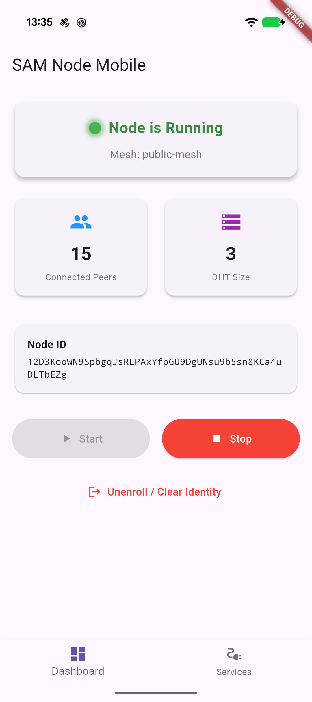
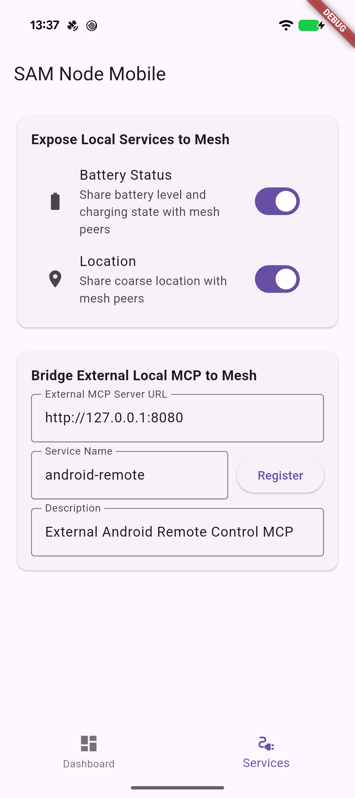

# SAM Node Mobile (Flutter Client)

This folder contains a Flutter application that packages and runs the native Go-based `sam-node` mesh client on mobile devices (Android and iOS) using Go's CGO compiler and Dart FFI (Foreign Function Interface).

---

## Architecture Overview

The app compiles the core Go mesh networking and routing logic into a C-compatible shared library (`.so` or `.a`), which is loaded dynamically by the Dart runtime. The Dart GUI manages the lifecycle of the node (enrollment, start, stop) via FFI function calls, while any tool registration, discovery, or mesh API queries are sent via standard HTTP JSON-RPC to the local loopback port of the node's sidecar server.

---

## Prerequisites

Before building the application, ensure you have configured:
1. **Flutter SDK**: Installed and configured (run `flutter doctor` to verify).
2. **Go Compiler**: Version 1.26+ installed.
3. **Android NDK**: Required to cross-compile the Go library for Android platforms. Ensure the `ANDROID_NDK_HOME` environment variable points to your NDK installation.
4. **Xcode**: (iOS only) Installed and configured for iOS compile targets.

---

## Compilation Instructions

To build the app, you must first compile the Go FFI library and bundle it inside the Flutter project:

### 1. Compile FFI Library

Run one of the following commands from the **repository root directory**:

*   **For Android ARM64 Devices (Physical Phones)**:
    ```bash
    make mobile-ffi-android
    ```
    *Copies the binary to `mobile/sam-node-app/android/app/src/main/jniLibs/arm64-v8a/libsam.so`*

*   **For Android x86_64 Emulators (AVD)**:
    ```bash
    make mobile-ffi-android-x86_64
    ```
    *Copies the binary to `mobile/sam-node-app/android/app/src/main/jniLibs/x86_64/libsam.so`*

*   **For iOS Devices**:
    ```bash
    make mobile-ffi-ios
    ```
    *Generates static archive `bin/ios/libsam.a`*

### 2. Run the App

Connect your device or start your emulator, then run:
```bash
cd mobile/sam-node-app
flutter run
```

---

## How to Use the Application

Once launched, the app displays a control interface:

1.  **Hub URL / Address**: The address of the SAM Hub (e.g., `https://bananas.sam-mesh.dev`).
2.  **Enrollment JWT**: A valid JWT token retrieved from your OIDC provider to authenticate the node registration.
3.  **Local API Token**: The secret bearer token used to secure the local sidecar REST APIs (defaults to `secret-token`).
4.  **Enroll Node**: Click this button first to generate the local Peer Identity and register the node with the Hub.
5.  **Start Node**: Launches the Go node runtime in the background. It will bind its local MCP sidecar to `127.0.0.1:5005`.
6.  **Stop Node**: Gracefully shuts down the background Go mesh client.

---

---

## Features & New Capabilities

### 📱 1. Embedded MCP Server & Real Telemetry
The app now includes an embedded Dart MCP server that exposes real-time telemetry from the device:
*   **Battery Status**: Level and charging state.
*   **Location**: Coarse/Fine coordinates (requires permissions).
*   **Foreground Service**: Keeps the node alive and connected even when the phone is idle or backgrounded (Android 14+ compatible).

### 🤖 2. Android 16 AppFunctions (On-Device MCP)
Exposes capabilities directly to the OS registry, allowing native assistants (like Gemini) to orchestrate tasks without manual app navigation.
*   `getMeshStatus`: Returns node stats and connected peers.
*   `callRemoteMeshTool`: Proxy to invoke tools on remote mesh peers.

---

## How to Use the Application

### 📸 Screenshots

| Node Status / Dashboard | Services & Telemetry |
|:---:|:---:|
|  |  |

1.  **Dashboard Tab**: Displays current status, Node ID, connected peers, and DHT size.
2.  **Services Tab**: Allows enabling/disabling embedded sensors (Battery/Location) and bridging external local MCP servers.

---

## Developer Integration & Usage Examples

### Option 1: CLI Usage (Technical Verification)

You can query the phone's telemetry from a remote machine (or another node) using the repository's `mcp-client` utility.

1.  **Discover tools on the remote phone service**:
    ```bash
    # Query the local SAM node proxy for tools hosted by the phone-sensors peer
    go run cmd/mcp-client/main.go \
      -url "http://localhost:8080/sam/<PHONE_PEER_ID>/mcp/phone-sensors" \
      -token "secret-token" \
      -list
    ```
    *Output:*
    *   `get_battery_status`: Returns the current battery level and charging status of the device.
    *   `get_location`: Returns the current coarse location of the device.

2.  **Query the location**:
    ```bash
    go run cmd/mcp-client/main.go \
      -url "http://localhost:8080/sam/<PHONE_PEER_ID>/mcp/phone-sensors" \
      -token "secret-token" \
      -tool "get_location"
    ```
    *Output:* `{"latitude": 42.2805588, "longitude": -8.6124088}`

---

### Option 2: AI Agent Interaction Flow

Clean, successful flow of an AI agent discovering and querying the mesh.

| Step | Action | Details / Tool | Result |
|---|---|---|---|
| 1 | Discover Peers & Tools | `find_remote_tools` | Found peer `<PHONE_PEER_ID>` hosting service `phone-sensors` with tool `mcp://phone-sensors/get_location`. |
| 2 | Verify Schema | `describe_remote_tool` | Confirmed `get_location` requires no input parameters: `{"input_schema": {"type": "object", "properties": {}}}`. |
| 3 | Query Location | `call_remote_tool` | Received: `{"latitude": 42.2805588, "longitude": -8.6124088}` |
| 4 | Resolve Address | Web Search | Geolocated to Vigo / Redondela area, Galicia, Spain. |
