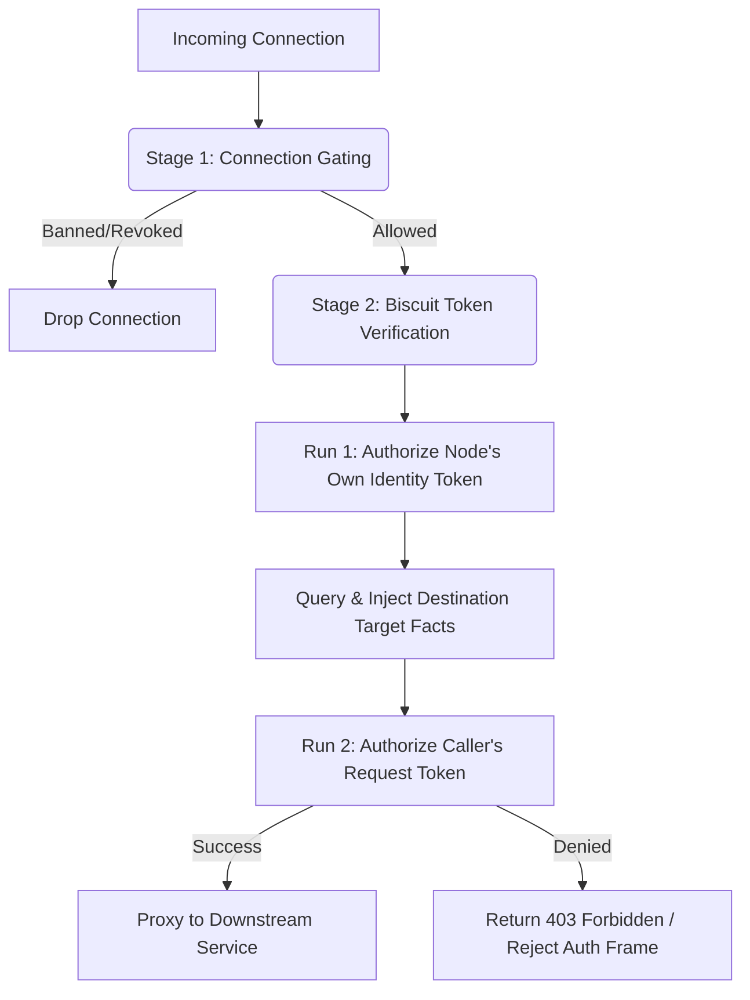

SAM uses a decentralized authorization model powered by [Biscuit](https://www.biscuitsec.org/). 
The `sam-hub` authenticates users via OIDC and injects **Facts** into their token based on `policies.yaml`. The `sam-node` operates offline, evaluating the token against baseline rules and optional local attenuation policies.

> [!IMPORTANT]
> **Default-Deny Security Posture**
> SAM enforces a strict **default-deny** model. By default, when a node joins the mesh, **all of its services (MCP tools, LLM inference endpoints) are completely locked down and inaccessible to other peers**. 
> Access is only permitted if the caller presents a Biscuit token containing capability facts (e.g., `granted_service_exact(...)`) explicitly issued by the Hub based on matched user roles.
> There are no built-in exceptions; even the catalog service (system://sam.catalog) must be explicitly permitted (e.g., via a role mapping) to facilitate peer-to-peer discovery.


## 1. OIDC to Biscuit Translation
The Hub automatically translates OIDC claims into undeniable cryptographic facts:

| OIDC Claim / Data | Biscuit Fact | Description |
| :--- | :--- | :--- |
| `sub` | `user("<sub-id>")` | The unique subject ID from the identity provider. |
| `email` | `email("<email>")` | The user's email address (if present). |
| `groups` | `group("<group-name>")` | One fact is injected for *each* group the user possesses. |
| `roles` / Resolved Roles | `role("<role-name>")` | One fact is injected for *each* role mapped or direct role. |
| Peer ID | `node("<peer-id>")`, `client_peer_id("<peer-id>")` | Binds the token to the specific agent's libp2p cryptographic identity. |
| Expiration | `expiration(<date>)` | The token expiration date based on the OIDC session. |

### 1.1 Translating Identity to Capability: OIDC to Biscuit
The core innovation of the SAM Network's security model is translating standard web identity (OIDC JSON Web Tokens defined in [OpenID Connect Core 1.0](https://openid.net/specs/openid-connect-core-1_0.html#Claims)) into decentralized capability tokens (Biscuits). This translation happens securely at the `sam-hub` during the authentication phase.

The Datalog authority facts generated by the Hub are constructed using the Biscuit [Symbol Table specification](https://doc.biscuitsec.org/reference/specifications.html#symbol-table), ensuring compact serialization and cryptographically undeniable credentials.

Here is exactly how an OIDC JWT is transformed into a policy-ready Biscuit:

#### 1. Claim Extraction
When an agent or user submits a valid OIDC JWT, the sam-hub verifies the token's signature against the Identity Provider. Once validated, the Hub extracts the payload claims—typically attributes like sub (subject), email, and custom arrays like groups or roles.

#### 2. Datalog Fact Generation
Biscuit policies are written in Datalog, a declarative logic language. The sam-hub acts as a translator, mapping the JSON claims from the OIDC token into immutable Datalog facts.

For example, an incoming OIDC payload like this:

```json
{
  "sub": "user-12345",
  "email": "agent@google.com",
  "groups": ["beta-testers", "engineering"]
}
```

Is translated by the Hub into the following Datalog facts:

```datalog
user("user-12345");
email("agent@google.com");
group("beta-testers");
group("engineering");
```

#### 3. Minting the Authority Block
The sam-hub takes these generated Datalog facts and embeds them into the Authority Block of a brand new Biscuit token. The Hub signs this block with its private cryptographic key.

Because the facts are sealed in the Authority Block by the Hub, any sam-node in the mesh can implicitly trust that the user holding the Biscuit possesses those specific emails and groups.

#### 4. Policy Evaluation at the Node
When the agent presents the Biscuit to a sam-node to execute a tool, the node evaluates its local policies against the facts embedded in the token.

Because the OIDC claims were translated into Datalog, a node administrator can write elegant, logic-based rules in policy.go or their YAML configs:

```datalog
// The node will only execute the tool if the Hub certified the agent is in the engineering group
allow if group("engineering");
```

## 2. Hub Policy Schema (`policies.yaml`)
Admins define central permissions by mapping OIDC roles to specific capabilities. 

* **`allowed_targets`**: Defines which logical groups or specific peers a user can route messages to, analogous to Active Directory security groups. Target definitions must be formatted as resolved facts (e.g., `group:<name>`, `user:<sub-id>`, `email:<email>`, `role:<role-name>`, or `node:<peer-id>`). *Note: These are evaluated dynamically at the destination node using its own identity (see Section 3.1).*
* **`allowed_services`**: Defines the application-level tools or endpoints a user can access. Services use a strict `type://name` convention (e.g., `mcp://db-agent` or `inference://openrouter`).
  * **Strict Namespaces**: There are no implicit fallbacks. `system://...` is used for internal services, `mcp://...` for node services, `inference://...` for AI models, etc. Service names must be valid domain labels (e.g. `value1.value2.value3`).
  * **Wildcards**: SAM natively supports domain-level wildcards to build complex policies. The hub generates specific facts like `granted_service_exact($type, $name)`, `granted_service_prefix($type, $prefix)`, `granted_service_suffix($type, $suffix)`, `granted_service_all_in_type($type)`, or `granted_service_all_types()`. You can grant access to an entire type via `mcp://*`, allow prefix-based wildcard matching like `mcp://*.service.local` (which matches services ending in `.service.local`), suffix-based wildcard matching like `mcp://service.*` (which matches services starting with `service.`), or global access to everything via `*`. Note that arbitrary partial matches (e.g., `dev-*` or `*-prod`) are not supported because they do not align with domain boundaries and will fail DNS name validation.
  * **MCP Namespace Convention**: The `mcp://` prefix (`api.MCPServicePrefix`) is the explicit convention for all Model Context Protocol targets. When remote nodes query local nodes for tool catalogs, if the local service is an MCP server, the proxy layer strictly enforces the authorization policy against the `mcp://` prefix.
> [!NOTE]
> The `*` global wildcard is a special case. It grants `granted_service_all_types()` fact, allowing the caller to invoke any tool regardless of its namespace or name.

```yaml
version: "v1alpha1"
roles:
  data-scientist:
    allowed_targets: 
      - "node:12D3KooW..."        # Specific peer ID
      - "group:backend-nodes"     # Logical group of peers
      - "role:admin"              # Nodes possessing the admin role
      - "user:auth0|123456"       # Node bound to a specific user sub
      - "email:db@example.com"    # Node bound to a specific email
    allowed_services: 
      - "mcp://db-agent"            # Access to specific MCP server
      - "inference://openrouter"    # Access to inference endpoints
      - "mcp://*"                   # Wildcard access to all MCP servers
    custom_datalog:
      - 'department("analytics");' # Raw injected facts
```

## 3. Node Local Policy Schema (`sam-node-config.yaml`)
Local developers can configure custom validation rules for their specific node under `attenuation:`. These rules are loaded directly into the main authorizer and evaluated entirely at the destination node.

```yaml
version: "v1alpha1"
attenuation:
  checks:
    - 'check if time($time), $time < 2026-12-31T00:00:00Z;'
  policies:
    - 'deny if user("untrusted_sub_id");'
    - 'deny if service("mcp", "restricted-tool"), group("externals");'
```

### 3.1 Understanding Authorization Limits (Local vs. Hub)
The SAM network operates on a Zero Trust architecture where authorization is typically managed centrally by the Hub. However, local nodes have full sovereignty over their resources and can define their own authorization policies using the local `sam-node` configuration.

Local policies (defined under `attenuation.policies`) configure the **Verifier** on the local node. 

* **Restrictive Policies (Deny)**: Local nodes can narrow down or restrict permissions granted by the Hub. For example, blocking users during off-hours, restricting specific contractors, or adding custom time-bound checks using `deny if` policies.
* **Permissive Policies (Allow)**: Local nodes can explicitly grant access to peers, overriding an **implicit deny** (e.g., when the Hub omits a `granted_service` fact). However, local allow policies **cannot bypass explicit constraints** (such as target restrictions or expirations) enforced via Hub-injected `check if` statements. In Biscuit, all `check if` conditions must evaluate to true; if the Hub seals a token with a target restriction that the destination node does not satisfy, the request is unconditionally rejected regardless of any local `allow if` policies.


### 3.2 Evaluating `allowed_targets` at the Destination
The SAM network operates on a Zero Trust architecture. The origin node does not police its own traffic. When the Hub injects `allowed_targets` permissions (like `- "group:backend-nodes"`) into the token, it creates `granted_target_group("backend-nodes")` capability facts and seals the token with a `target_restricted()` fact. If no targets are specified, the Hub mints a `target_unrestricted()` fact.

It is up to the **destination node** to mathematically prove that it is the intended target. To do this, the destination node automatically injects its own identity into the local authorization context as target facts (e.g., `target_fact("group", "backend-nodes")`).

The destination node enforces this via a baseline check:
```datalog
check if allow_network_target($fact, $val) or target_unrestricted();
```

Because the target logic is baked directly into the node's middleware, you don't need to write manual Datalog rules for it. The node dynamically deduces `allow_network_target($fact, $val)` if any of its injected `target_fact`s match the `granted_target_*` facts presented in the incoming token.

If the token is `target_restricted()` and the destination node does not possess an identity matching the granted targets, the connection is instantly rejected.

> [!NOTE]
> **Policy Evaluation Precedence**
> Local policies defined in `sam-node-config.yaml` are evaluated **before** baseline rules. This means local administrators can write rules that explicitly `deny` access based on custom logic, overriding access granted by the Hub. While they can also use local `allow` policies to bypass Hub service capability constraints, all hardcoded baseline checks (OIDC signatures, replay defense, and target group restrictions) remain strictly enforced.

## 4. Node Baseline Security Rules

Every `sam-node` enforces a set of baseline security rules (defined in Go code) to secure the transport layer. These rules run automatically before evaluating custom OIDC or local policies:

### 4.1 Replay & Impersonation Prevention
Every request must prove that the libp2p cryptographic peer ID of the connection matches the client peer ID embedded in the authorization token:
```datalog
check if client_peer_id($id), connection_peer_id($id);
```

### 4.2 The Catalog Service (`sam.catalog`)
To allow remote peers to discover tools and query connectivity, each node hosts a built-in catalog service at the special target `sam.catalog`. This service exposes local metadata tools (e.g. `list_local_services`, `get_mesh_info`).

Access to the catalog service is not granted by default and must be explicitly permitted (e.g. via a Hub role mapping allowing `system://sam.catalog` to verified nodes) to facilitate peer-to-peer discovery.

Example policy allowing catalog discovery:
```datalog
allow if service("system", "sam.catalog");
```

## 5. Ingress Authorization Pipeline (Execution Flow)

When a node receives an incoming connection request (via P2P HTTP Ingress or wrapped protocol streams like MCP/Inference), it performs a multi-stage verification pipeline.

### 5.1 Pipeline Stages



1. **Stage 1: Connection Gating (Layer 2)**
   - Performed immediately at the connection manager level (`gate.go`).
   - Checks the remote peer ID against local blacklist (`Store.IsBanned`) and revocation caches (`revokedPeers`).
   - Does not parse Biscuit tokens. Connection is dropped early if matched.

2. **Stage 2: Biscuit Token Verification (Layer 3/4)**
   - Handled inside node middleware (`middleware.go`).
   - Performs exactly **two Biscuit authorizer execution runs** to process authorization:

#### Run 1: Destination Identity Fact Evaluation
- **Target**: The node's **own identity token** (issued by the Hub during enrollment).
- **Purpose**: We must mathematically evaluate the node's own OIDC group/user claims and node ID to produce `target_fact(...)` datalog assertions (e.g. `target_fact("group", "backend-nodes")`). These facts represent *who we are*.
- **Mechanism**:
  1. We create an authorizer for our own token signed by the Hub's public key.
  2. We add a baseline `allow if true` policy. This policy is required by Biscuit so that the authorizer can execute (since the token itself holds only identity facts and has no operation-level authorization policies).
  3. We execute `Authorize()` to verify our token signature and validate internal checks (such as expiration).
  4. We query `api.TargetFactRules` against this authorizer to extract target facts.
  5. We inject these extracted `target_fact` assertions into the main request authorizer.

#### Run 2: Caller Request Authorization
- **Target**: The caller's **request token** (the Biscuit token presented in the request's `X-Sam-Biscuit` header or `AuthFrame`).
- **Purpose**: Verifies that the caller has been granted access by the Hub to the requested target service, checks for replay protection, and evaluates local attenuation constraints.
- **Mechanism**:
  1. We create an authorizer for the caller's token using the Hub's public key.
  2. We inject the target matching facts derived from Run 1.
  3. We add baseline rules (e.g. peer ID matching connection ID check, system catalog access policies) and local attenuation configurations (`sam-node-config.yaml`).
  4. We execute `Authorize()` to check all signatures, checks, and policies. If successful, the request is forwarded to the underlying service.

## 6. Comprehensive Mesh Policy Example

Here is a representative configuration for an engineering mesh deployment. It shows how to use roles, target groups, service namespaces, wildcards, and local attenuation checks to build a zero-trust development network.

### 6.1 Central Hub Policy (`policies.yaml`)

Deploy this file on `sam-hub` to define global roles and user/service-account mappings.

```yaml
version: "v1alpha1"

# Bindings map OIDC identities (sub/user, email, groups) to SAM Roles.
# Note: Kubernetes projected service account tokens do not carry 'groups' claims,
# so they must be bound explicitly using their 'user' claim format.
bindings:
  # 1. Global Admins (Infrastructure SAs, Lead Architects)
  - members: ["user:system:serviceaccount:sam-mesh:admin-sa"]
    role: "admin"
  - members: ["group:infrastructure-leads"]
    role: "admin"

  # 2. Software Developers
  - members: ["group:software-engineering-team"]
    role: "developer"

  # 3. Data Scientists & AI Engineers
  - members: ["group:data-science-team"]
    role: "data-scientist"

  # 4. Contractors / Read-Only Audits
  - members: ["email:audit-contractor@external.com"]
    role: "auditor"

# Roles define the allowed destinations (allowed_targets) and tools (allowed_services)
roles:
  # Admins have full, unrestricted access to the entire mesh
  admin:
    allowed_targets:
      - "*"
    allowed_services:
      - "*"

  # Developers can call development tools on dev nodes
  developer:
    allowed_targets:
      - "group:dev-nodes"           # Can only call nodes in the 'dev-nodes' target group
    allowed_services:
      - "mcp://code-reviewer"       # Can call the code reviewer tool
      - "mcp://git-helper"          # Can call git helper tools
      - "mcp://build-runner.*"      # Wildcard: matches any build runner sub-service (e.g. build-runner.go)

  # Data Scientists can call database tools and all AI inference endpoints
  data-scientist:
    allowed_targets:
      - "group:data-nodes"          # Can call nodes in the 'data-nodes' target group
      - "node:12D3KooWSpecialNode"  # Can call a specific high-compute node directly
    allowed_services:
      - "mcp://db-reader"           # Can query databases
      - "inference://*"             # Wildcard: can access any LLM inference service

  # Auditors can only query metadata catalogs and cannot call operational tools
  auditor:
    allowed_targets:
      - "*"
    allowed_services:
      - "system://sam.catalog"      # Strictly limited to tool discovery/metadata
```

### 6.2 Node-Level Configuration (`sam-node-config.yaml`)

Deploy this file on a specific database node in the `data-nodes` group to register services and enforce local restrictions.

```yaml
version: "v1alpha1"

# Static services hosted by this local node
services:
  - type: "mcp"
    name: "db-reader"
    description: "Read-only SQL execution tool"
    target_url: "http://127.0.0.1:5001/mcp"

  - type: "mcp"
    name: "db-writer"
    description: "Database modification tool"
    target_url: "http://127.0.0.1:5002/mcp"

# Local policies further restrict or override permissions on this specific node
attenuation:
  # local rules generate new facts based on existing ones
  rules:
    # e.g., 'is_off_hours() <- current_hour($h), $h >= 21;'

  # local checks must be satisfied for any connection to succeed
  checks:
    # 1. Enforce strict TLS certificate expiry limit
    - 'check if time($time), $time < 2026-12-31T23:59:59Z;'

  # local policies can contain deny rules (to restrict Hub grants) or allow rules (to override implicit denies)
  policies:
    # 2. Block db-writer calls during off-hours (9 PM to 6 AM)
    - 'deny if service("mcp", "db-writer"), current_hour($hour), $hour >= 21;'
    - 'deny if service("mcp", "db-writer"), current_hour($hour), $hour < 6;'
    
    # 3. Restrict contractors from accessing db-writer even if Hub granted it
    - 'deny if service("mcp", "db-writer"), role("contractor");'
    
    # 4. Explicitly allow local admin bypass
    - 'allow if user("local-admin");'
```
