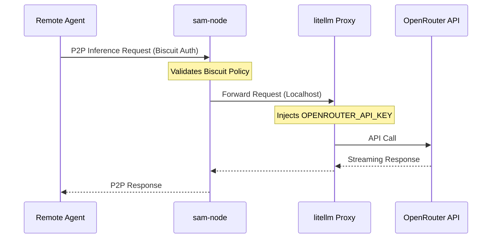

# Exposing Inference Services: OpenRouter

In the Sovereign Agent Mesh (SAM), large language models (LLMs) and foundational model APIs are exposed across the mesh as **Inference Services**, not just standard Model Context Protocol (MCP) servers. This allows your deployed agents to dynamically discover, route, and consume inference capabilities directly through the P2P network, utilizing SAM's decentralized authorization (Biscuit) for access control.

This guide explains how to expose [OpenRouter](https://openrouter.ai/) as an inference service to the mesh, completely shielding your API keys from external peers.

## 1. The Proxy Architecture

SAM enforces a Zero Trust architecture. Rather than distributing your `OPENROUTER_API_KEY` to every agent in the network, you deploy a local proxy container alongside a dedicated `sam-node`. 

The `sam-node` handles the P2P routing and mesh identity (validating incoming requests from other mesh agents). The proxy container (such as [`litellm`](https://litellm.ai/) or standard Nginx) holds the API key and securely forwards the requests upstream to `https://openrouter.ai/api/v1`.



## 2. Configuring the Inference Service

To expose the proxy to the mesh, you must define it as an `inference` service in your node's configuration (`sam-node.yaml`), and set the `target_url` to the proxy's local endpoint.

```yaml
version: "v1alpha1"
services:
  - type: inference
    name: openrouter
    description: "OpenRouter Proxy Inference Service"
    target_url: "http://localhost:4000" # Local endpoint of the proxy
```

## 3. Decentralized Authorization

By default, services on your node are completely locked down. To allow agents in the mesh to utilize your OpenRouter inference service, you must explicitly allow the service via the node's local `attenuation` policies.

The service format for an inference service is always `inference:<service-name>`. 

To allow **any** authenticated mesh agent to use the service:
```yaml
version: "v1alpha1"
attenuation:
  policies:
    - 'allow if service("inference", "openrouter");'
    - 'allow if service("system", "/sam/catalog");' # Required for discovery
  checks: []
```

If you only want to allow specific identities or groups (e.g., agents belonging to the "research" group), you can restrict the policy based on the cryptographic facts injected by the Hub:
```yaml
    - 'allow if service("inference", "openrouter"), group("research");'
```

## 4. Deploying the Node

When deploying (for instance, via Kubernetes), you deploy both containers in the same Pod so they can communicate over `localhost`. The `sam-node` container runs with the `--trust-hub-rbac` flag to trust the identity facts from the Hub.

```yaml
      containers:
      # 1. The litellm Proxy holding the secret key
      - name: openrouter-proxy
        image: ghcr.io/berriai/litellm:main-stable
        command: ["litellm", "--model", "openrouter/auto", "--port", "4000"]
        env:
          - name: OPENROUTER_API_KEY
            value: "sk-or-v1-..."
            
      # 2. The SAM node enforcing P2P authorization
      - name: sam-node
        image: ghcr.io/google/sam-node:latest
        args: 
          - "run"
          - "--config=/etc/sam/sam-node.yaml"
          - "--trust-hub-rbac"
          # ... (other required arguments like --jwt-path)
```

Once running, any authorized agent in the Sovereign Agent Mesh can discover the `inference` service via the catalog and route inference requests securely through your node!
