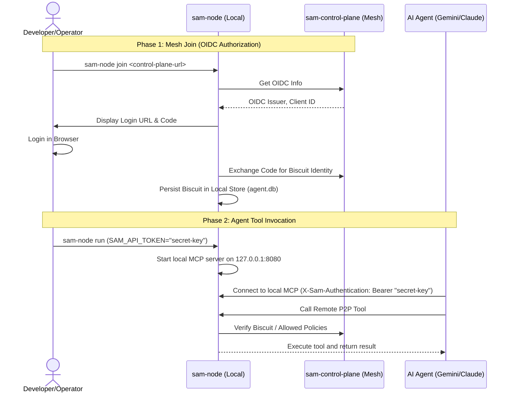

SAM nodes (`sam-node`) act as local security gateways and tool proxies for your AI agents (such as Google Gemini, Claude Code, or Claude Desktop). This document explains how to authenticate a node to the mesh and configure your agents to use it.

---

## 1. Node Lifecycle Overview

Connecting your AI agent to the Sovereign Agent Mesh involves two phases:

```mermaid
sequenceDiagram
    actor User as Developer/Operator
    participant Node as sam-node (Local)
    participant ControlPlane as sam-control-plane (Mesh)
    participant Agent as AI Agent (Gemini/Claude)
    
    Note over User,ControlPlane: Phase 1: Mesh Join (OIDC Authorization)
    User->>Node: sam-node join <control-plane-url>
    Node->>ControlPlane: Get OIDC Info
    ControlPlane-->>Node: OIDC Issuer, Client ID
    Node->>User: Display Login URL & Code
    User->>User: Login in Browser
    Node->>ControlPlane: Exchange Code for Biscuit Identity
    Node->>Node: Persist Biscuit in Local Store (agent.db)

    Note over User,Agent: Phase 2: Agent Tool Invocation
    User->>Node: sam-node run (SAM_API_TOKEN="secret-key")
    Node->>Node: Start local MCP server on 127.0.0.1:8080
    Agent->>Node: Connect to local MCP (X-Sam-Authentication: Bearer "secret-key")
    Agent->>Node: Call Remote P2P Tool
    Node->>ControlPlane: Verify Biscuit / Allowed Policies
    Node-->>Agent: Execute tool and return result
```

---

## 2. Phase 1: Joining the Mesh (`sam-node join`)

Before starting the node daemon, you must authorize your node and obtain a cryptographic Biscuit identity.

### Standard Login
Run the `join` command, pointing to the mesh control plane:
```bash
sam-node join https://bananas.sam-mesh.dev
```

*   **Browser Flow**: The CLI will discover the OIDC credentials from the control plane, print an OIDC authorization URL, and attempt to open your system's default web browser automatically.
*   **Approval**: Log in with your corporate or identity credentials (e.g. Google Accounts), approve the authorization request, and return to the terminal. The node will automatically exchange the credentials for a Biscuit token and save it to `~/.config/sam-mesh/agent.db`.

### Headless (Server) Login
If you are running the node on a remote server via SSH (without a web browser), force headless out-of-band mode:
```bash
sam-node join https://bananas.sam-mesh.dev --headless
```
When the OIDC provider supports device authorization, SAM automatically uses device flow (no pasted callback code required): it prints a verification URL/code and polls until approval. If device authorization is unavailable, SAM falls back to OOB code-paste flow.

### Choosing the Auth Flow Explicitly
By default (`--auth-mode auto`) SAM picks the flow for you: device flow in headless environments when available, the loopback browser flow otherwise (with an automatic device fallback if the browser can't be opened). For deterministic automation (e.g. CI/CUJ harnesses), force a specific flow instead of relying on environment detection:
```bash
# Force RFC 8628 device flow (no code to paste back)
sam-node join https://bananas.sam-mesh.dev --auth-mode device
```
Supported values: `auto` (default), `device`, `oob`, `browser`. `--auth-mode device` fails fast if the provider does not advertise a `device_authorization_endpoint`.

### Automatic Token Renewal
To allow long-lived nodes to automatically renew their tokens in the background, request offline access (refreshes the OIDC session):
```bash
sam-node join https://bananas.sam-mesh.dev --offline-access
```

---

## 3. Phase 2: Running the Node daemon (`sam-node run`)

Once authorized, you start the node gateway. The gateway spins up a local Model Context Protocol (MCP) server.

Run the node daemon, securing the local API endpoint with a custom token:
```bash
SAM_API_TOKEN="my-agent-super-token-123" sam-node run --bind-addr "127.0.0.1:8080"
```

### Key CLI Parameters
*   `--bind-addr`: The local TCP address where the node's local HTTP server runs (default: `127.0.0.1:8080`). Pass an empty value to serve only on the Unix socket.
*   `--socket-path`: Unix socket serving the same API (default: `<data-dir>/sam.sock`). Pass an empty value to disable it.
*   API token (`SAM_API_TOKEN` env or `--api-token-path` file): a security token required by any local AI agent attempting to connect to your node over TCP.
*   `--data-dir`: Custom path to store configurations and Biscuit tokens (defaults to `~/.config/sam-mesh` or env `SAM_DATA_DIR`).

---

## 4. Connecting your AI Agents

Your AI agent connects to the node's local MCP server. The local server translates standard MCP queries (like `listTools` or `callTool`) into secure P2P mesh commands.

### Exposing the API
The local MCP endpoint is served over **Streamable HTTP** at:
`http://127.0.0.1:8080/mcp`

The node serves the very same API on a Unix socket, `<data-dir>/sam.sock`
(usually `~/.config/sam-mesh/sam.sock`). Reaching that socket already proves
the caller is the user who owns it — the same bar as reading the token file —
so requests over it need no token, exactly like `docker.sock`:

```bash
curl --unix-socket ~/.config/sam-mesh/sam.sock \
  http://localhost/v1/chat/completions \
  -H 'Content-Type: application/json' \
  -d '{"model": "mistralai/mistral-7b-instruct", "messages": [{"role": "user", "content": "Write a haiku about a decentralized mesh network."}]}'
```

(`http://localhost` is a placeholder host that clients ignore once they dial a
socket.) The socket is created with `0600` permissions inside the `0700` data
directory, and removed when the node stops.

Most MCP clients speak only stdio or HTTP, so the TCP listener stays on by
default and the socket is an addition rather than a replacement. Use
`--socket-path ""` to run without it, or `--bind-addr ""` to drop the TCP port
and serve the API exclusively over the socket, which leaves the node with no
listening port and no shared secret to manage.

### Authentication
When configuring your agent client, you must pass the API token in a SAM-specific
header — not the standard `Authorization` header:
```http
X-Sam-Authentication: Bearer my-agent-super-token-123
```
This leaves `Authorization` free to always mean the credential for whatever
remote service you're calling *through* the node (e.g. a `mcp://` or
`inference://` service that requires its own upstream credential) — it passes
straight through untouched and is never used to authenticate to the node itself.

> For MCP clients that only support a plain `Authorization` header, the `/mcp`
> endpoint (and the `/sam/service/*` control endpoints) also accept it as a
> compatibility alias, since they never forward it anywhere. The egress/inference
> proxy (`/sam/<peer>/...`) does **not** accept this fallback — there,
> `Authorization` is reserved exclusively for the destination's own credential.

### OpenAI Facade & Inference Connectivity

SAM nodes expose two ways for AI clients and OpenAI SDKs to interact with `type: inference` services across the mesh:

1. **OpenAI Facade Interface (Recommended)**: Point standard OpenAI SDKs to `base_url="http://127.0.0.1:8080/v1"`. The facade aggregates available mesh models on `/v1/models` and handles seamless load balancing and failover for `/v1/chat/completions`.
2. **Raw Egress Proxy Interface**: Power-users who want to explicitly route to a specific peer's inference backend use `/sam/{peer}/inference/{service}`. When targeting an OpenAI-compatible service via raw proxy, ensure `base_url` includes the explicit `/v1` namespace suffix (e.g. `http://127.0.0.1:8080/sam/{peer}/inference/{service}/v1`).

### Specific Integration Guides
Explore our step-by-step guides for integrating your node with popular agent clients:
*   🚀 **[Google Gemini AI Agent](../integrations/gemini.md)**: Connect using Python scripts and the google-genai SDK.
*   💻 **[Claude Desktop](../integrations/claude-desktop.md)**: Expose P2P tools directly to your Claude Desktop application menu.
*   🤖 **[Claude Code](../integrations/claude-code.md)**: Add your local node tools directly to the Claude CLI.
*   🔌 **[OpenClaw](../integrations/openclaw.md)**: Setup remote tool bridges for OpenClaw clusters.
