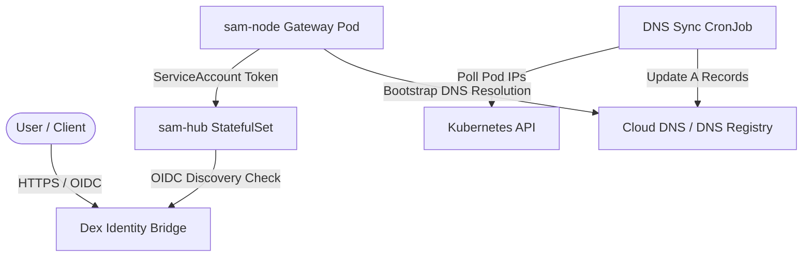

This guide explains how to deploy a production-grade SAM cluster (Hub, DNS synchronizer, OIDC bridge, and Nodes) in a Kubernetes environment (like GKE, EKS, AKS, or custom bare-metal clusters), based on our official public testnet architectures.

---

## 1. Architecture Overview

A production SAM deployment consists of:
*   **Dex (OIDC Provider)**: Serves as the identity bridge, federation point, and login broker.
*   **SAM Hub (`sam-hub`)**: Runs as a **StatefulSet** to maintain stable network identity. P2P nodes query these bootstrap pods to connect to the mesh.
*   **DNS Sync CronJob**: Dynamically queries the StatefulSet pod IP addresses and updates DNS A/AAAA records for P2P bootstrap resolution.
*   **SAM Nodes (`sam-node`)**: Deployed as containerized gateways that authenticate securely to the hub using Kubernetes Workload Identity (ServiceAccount token projection).



---

## 2. Step 1: Deploying the OIDC Provider (Dex)

Dex maps external accounts (Google, GitHub, LDAP) to standard OIDC identities in the cluster.

### 1. Provision Dex Secrets
Idempotently create the secret containing your OAuth client applications' credentials:
```bash
kubectl create secret generic dex-secrets \
  --namespace=dex \
  --from-literal=google-client-id="<my-google-client-id>" \
  --from-literal=google-client-secret="<my-google-client-secret>" \
  --from-literal=github-client-id="<my-github-client-id>" \
  --from-literal=github-client-secret="<my-github-client-secret>" \
  --from-literal=cli-oauth-secret="<my-ephemeral-cli-oauth-secret>" \
  --dry-run=client -o yaml | kubectl apply -f -
```

### 2. Apply Dex Manifests
Deploy the Dex deployment and configuration mapping:
```yaml
# dex-config.yaml
apiVersion: v1
kind: ConfigMap
metadata:
  name: dex-config
  namespace: dex
data:
  config.yaml: |
    issuer: https://AUTH.YOUR-DOMAIN.COM
    storage:
      type: kubernetes
      config:
        inCluster: true
    web:
      http: 0.0.0.0:5556
    connectors:
      - type: google
        id: google
        name: Google
        config:
          clientID: $GOOGLE_CLIENT_ID
          clientSecret: $GOOGLE_CLIENT_SECRET
          redirectURI: https://AUTH.YOUR-DOMAIN.COM/callback
    staticClients:
      - id: YOUR-CLI-AUDIENCE
        name: 'SAM Mesh native client'
        secret: $CLI_OAUTH_SECRET
        redirectURIs:
          - 'urn:ietf:wg:oauth:2.0:oob'
          - 'http://localhost:8000'
```
Deploy the deployment manifests located in the repository's `.github/k8s/dex-deployment.yaml` and wait for readiness:
```bash
kubectl rollout status deployment/dex -n dex
```

---

## 3. Step 2: Deploying the SAM Hub

The SAM Hub must have a stable network identifier (multiaddr) so nodes can discover it.

### 1. Generate the Hub Private Key Secret
Generate and save a random 32-byte signing seed key:
```bash
HUB_KEY=$(openssl rand -hex 32)
kubectl create secret generic sam-hub-secret \
  --namespace=sam \
  --from-literal=sam-hub-key="${HUB_KEY}"
```

### 2. Configure Access Control policies (`policies.yaml`)
Map identities (ServiceAccounts or email handles) to authorized roles. Save this as a ConfigMap:
```yaml
apiVersion: v1
kind: ConfigMap
metadata:
  name: sam-hub-policies
  namespace: sam
data:
  policies.yaml: |
    version: "v1alpha1"
    bindings:
      - user: "system:serviceaccount:sam-nodes:sam-node-sa"
        role: "node-role"
    roles:
      node-role:
        mcp:
          allowed_services:
            - "system:sam.catalog"
```
```bash
kubectl apply -f policies-configmap.yaml
```

### 3. Deploy the Hub StatefulSet
Deploy a StatefulSet to allocate stable hostnames (`sam-hub-0`, `sam-hub-1`):
```yaml
apiVersion: apps/v1
kind: StatefulSet
metadata:
  name: sam-hub
  namespace: sam
spec:
  serviceName: "sam-hub"
  replicas: 3
  template:
    spec:
      containers:
      - name: sam-hub
        image: ghcr.io/google/sam-hub:latest
        env:
        - name: HOST_IP
          valueFrom:
            fieldRef:
              fieldPath: status.hostIP
        - name: SAM_HUB_KEY
          valueFrom:
            secretKeyRef:
              name: sam-hub-secret
              key: sam-hub-key
        ports:
        - containerPort: 9090
          name: metrics
        - containerPort: 4501
          protocol: TCP
          name: p2p-tcp
        - containerPort: 4501
          protocol: UDP
          name: p2p-udp
        args:
        - "--listen=/ip4/0.0.0.0/tcp/4501"
        - "--listen=/ip4/0.0.0.0/udp/4501/quic-v1"
        - "--external-multiaddr=/dnsaddr/BOOTSTRAP.YOUR-DOMAIN.COM"
        - "--issuer=https://AUTH.YOUR-DOMAIN.COM"
        - "--allowed-audiences=YOUR-CLI-AUDIENCE"
        - "--policy-file=/etc/sam/policies/policies.yaml"
        volumeMounts:
        - name: policies-volume
          mountPath: /etc/sam/policies
      volumes:
      - name: policies-volume
        configMap:
          name: sam-hub-policies
```

---

## 4. Step 3: DNS Synchronization (DHT Bootstrapping)

In a decentralized DHT network, nodes need stable DNS multiaddrs (`/dnsaddr/BOOTSTRAP.YOUR-DOMAIN.COM`) to resolve bootstrap peers. Since Kubernetes StatefulSet pod IP addresses change on restart, you must deploy a sync cronjob that updates A/AAAA records on your DNS provider.

### DNS Sync CronJob Example
The sync script:
1. Queries the Kubernetes API for the external/internal IP addresses of the `sam-hub` pods.
2. Updates your Cloud DNS zone (e.g. Google Cloud DNS, AWS Route53) dynamically.
3. Announce new multiaddrs via TXT records.

Refer to [dns-sync-cronjob-template.yaml](https://github.com/google/sam/blob/main/.github/k8s/dns-sync-cronjob-template.yaml) for our official Cloud DNS sync cronjob.

---

## 5. Step 4: Deploying SAM Nodes (Workload Identity)

To secure nodes without distributing static passwords, configure nodes to authenticate via **ServiceAccount projected tokens** (Workload Identity Federation).

### 1. Create a ServiceAccount
```yaml
apiVersion: v1
kind: ServiceAccount
metadata:
  name: sam-node-sa
  namespace: sam-nodes
```

### 2. Configure Node Identity and Services
Create a ConfigMap defining the node's local services and local security target identity (see the [Node Configuration Guide](../node-configuration/) for schema details):

```yaml
apiVersion: v1
kind: ConfigMap
metadata:
  name: sam-node-config
  namespace: sam-nodes
data:
  sam-node.yaml: |
    version: "v1alpha1"
    services:
      - type: mcp
        name: db-agent
        command: ["echo", "placeholder db-agent service"]
    attenuation:
      rules:
        - 'department("analytics") <- true;'
      policies:
        - 'deny if user("untrusted_user");'
```

### 3. Deploy Nodes using Token Projection
Deploy the nodes. We use a `projected` volume to request a short-lived token containing the audience expected by the hub (`sam-hub-audience`):

```yaml
apiVersion: apps/v1
kind: Deployment
metadata:
  name: sam-node
  namespace: sam-nodes
spec:
  replicas: 5
  template:
    spec:
      serviceAccountName: sam-node-sa
      containers:
      - name: sam-node
        image: ghcr.io/google/sam-node:latest
        args: 
          - "run"
          - "--config=/etc/sam/sam-node.yaml"
          - "--hub=http://sam-hub.sam.svc.cluster.local:9090"
          - "--jwt-path=/var/run/secrets/tokens/sam-token"
          - "--api-token=secret-token"
        volumeMounts:
        - name: config-volume
          mountPath: /etc/sam
        - name: sam-token
          mountPath: /var/run/secrets/tokens
          readOnly: true
      volumes:
      - name: config-volume
        configMap:
          name: sam-node-config
      - name: sam-token
        projected:
          sources:
          - serviceAccountToken:
              path: sam-token
              expirationSeconds: 3600
              audience: "sam-hub-audience"
```

---

## 6. Local Sandbox Testing (Kind)

If you are looking to test Kubernetes deployments locally in a sandboxed cluster without external cloud dependencies, please follow the [Local Kubernetes Testing Guide](../../development/kubernetes-deployment/).
