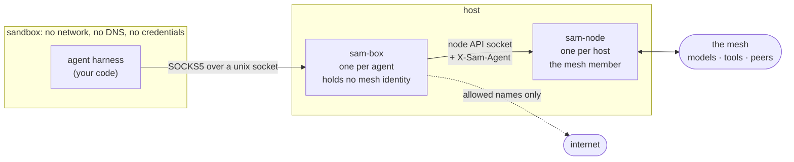
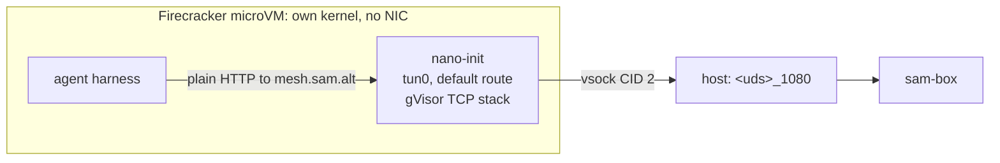

## What you actually deploy

An agent is usually three things bolted together: some logic that decides what
to do next, a model that does the thinking, and a set of tools it can act
with. Deploying one normally means deploying all three, plus the credentials
for the model, plus network access broad enough for the tools to work — which
in practice means the agent can reach the whole internet, because nobody knows
in advance which addresses it will need.

On SAM you deploy **only the first one**. The mesh provides the other two, and
the network the agent gets is exactly the network its policy describes.

The piece you write and ship is the **harness**: the loop that holds the
conversation, decides when to call a tool, and knows when the work is done.
Everything else is asked for by name at runtime.

| | Who provides it | How the agent asks |
| --- | --- | --- |
| **Harness** | You. This is your code. | — |
| **Inference** | The mesh, from whichever peer policy allows | `http://mesh.sam.alt/v1` |
| **Tools (MCP)** | The mesh, local and remote peers alike | `http://mesh.sam.alt/mcp` |
| **Network** | The boundary, per flow, by name | ordinary HTTP to allowed names |

The consequence worth pausing on: **the harness holds no credentials**. There
is no model API key in the sandbox, no mesh token, no service account file.
This is not a convenience. An agent that holds a key can leak a key, and an
agent that can be prompt-injected into leaking one will eventually be.

## The three concepts

### Inference is a name, not an endpoint

The agent asks `mesh.sam.alt` for a model. It does not know which peer answers,
and it cannot find out. Policy decides which providers this agent may use, and
the mesh picks among them.

```python
client = AsyncOpenAI(base_url="http://mesh.sam.alt/v1", api_key="unused")
```

That is an ordinary OpenAI SDK client. Nothing about it is SAM-specific, which
matters: if running on the mesh required a bespoke client, every existing agent
would have to be rewritten to move onto it.

The `api_key` is a placeholder because the SDK insists on one. The real
authentication happens outside the sandbox, where the agent cannot reach it.

### Tools arrive over MCP, and the list is per-agent

The same name serves tools:

```python
async with streamable_http_client("http://mesh.sam.alt/mcp") as (read, write):
    async with ClientSession(read, write) as session:
        await session.initialize()
        tools = await session.list_tools()
```

The transport is Streamable HTTP, which is what the mesh serves. The older SSE
transport is answered with 400, and that arrives late enough to look like a
network problem rather than a protocol one.

Two agents on the same node can list different tools, because the mesh answers
according to who is asking. Tools hosted by other peers appear alongside local
ones and are called identically — the agent cannot tell, and does not need to.

A refused tool call comes back as an error the model can read, not a crash. A
denial is information the agent should reason about, not an outage.

### The boundary is the only way out

The sandbox has no network interface, no DNS resolver and no route. It has a
single Unix socket, on which `sam-box` speaks SOCKS5.

Every connection the agent opens arrives there as a **name**, and the boundary
decides what it is:

- `mesh.sam.alt` — the mesh's own surface: inference and tools.
- `<service>.mcp.sam.alt` — a specific mesh service, provider chosen by discovery.
- anything else — matched against the agent's egress allowance, and refused if absent.

Because the destination arrives as a name rather than an address, policy can be
written about `api.github.com` rather than about whatever IP that resolves to
this week. And because the sandbox has no other route, a refusal is not a
speed bump the agent can route around — there is nothing to route around it
with.

### Identity is asserted about the agent, never by it

`sam-box` reads a **bundle** that names the agent and describes what it may
reach. The bundle lives outside the sandbox. The agent never sees it and cannot
change it.

```yaml
version: v1
agent:
  id: researcher-1.prod.acme.example
  external_id: system:serviceaccount:agents:researcher
egress:
  allow:
    - api.github.com
```

Writing that file is not enough to become that agent. `sam-box` verifies a
platform credential — a Kubernetes projected service account token, for example
— and accepts the bundle only if the credential's subject matches
`external_id`. The mesh identity is a claim about a platform identity that
something else already vouched for.

On every request the gateway asserts the agent to the node, overwriting
anything the sandbox tried to set. Mesh policy can then be written about the
agent rather than about the host it happens to run on.

## The architecture



Two separations do the work.

**One `sam-node` per host, one `sam-box` per agent.** The node is the mesh
member: it enrols, holds the mesh identity and maintains peer connections. The
box holds no identity of its own — it consumes the node's API socket on the
agent's behalf and names the agent on every request. Adding an agent therefore
costs a `sam-box`, not a mesh member: [measured at about 25 MB and 150 ms](../../scale-report/),
rather than a new enrolment and a new peer in the DHT. One node has been run
with a thousand agents behind it.

**The node's API stays on the node's side of the boundary.** An agent never
reaches it. What the agent gets is the curated surface the gateway builds on
top: inference, tools, and permitted egress. The node's own control endpoints —
service registration, peer management — are not part of it.

## Running the example

The example harness is in
[`development/examples/agent-harness`](https://github.com/google/sam/tree/main/development/examples/agent-harness).
It is about a hundred lines and does something real: discovers tools, calls a
model, runs the tool loop, stops when done.

### 1. A node

You need a `sam-node` enrolled in a mesh, serving its API on a socket:

```bash
sam-node run --socket-path /run/sam/node.sock --data-dir /var/lib/sam
```

### 2. A boundary for the agent

```bash
sam-box run \
  --socket /run/sam/agent.sock \
  --sidecar-socket /run/sam/node.sock \
  --bundle ./bundle.yaml \
  --credential-issuer https://kubernetes.default.svc \
  --credential-audience sam
```

Credential verification is on by default. For a local experiment where there is
no issuer to verify against, `--insecure-unverified-bundle` turns it off and
says plainly what you are giving up: whoever can write the bundle decides which
agent this sandbox is.

### 3. The sandbox

The agent needs the boundary socket and nothing else. For a container:

```bash
docker run --rm \
  --network none \
  --cap-add NET_ADMIN \
  --device /dev/net/tun \
  -v /run/sam/agent.sock:/run/agent.sock \
  agent-harness "Summarise the open issues in our repo"
```

`--network none` is the assertion, not just the arrangement. If any of this
worked because the container could route somewhere, it would be proving nothing.

Notice what is *not* passed: no API key, no mesh token, no endpoint, and **no
proxy variable**. `nano-init` runs as PID 1, builds one `tun0`, makes it the
default route and terminates the sandbox's TCP itself, opening a SOCKS5 flow to
the boundary per connection. The agent asks for `mesh.sam.alt` like any other
host and its traffic leaves through the tun because there is nowhere else for
it to go.

That distinction is worth dwelling on, because the obvious alternative is to set
`HTTP_PROXY` and be done. That is the wrong layering: an agent that has to
*cooperate* with its own confinement is not confined. The next library that
ignores the convention, the next subprocess that clears its environment, the
next protocol that is not HTTP — each one is outside the boundary. Routing does
not have that failure mode, because nothing has to agree to it.

The sandbox image needs nothing else: no proxy helper, no `socat`, no
`iproute2`. That matters more than tidiness, since image size is what decides
how many agents fit on a host.

### 4. Watch what it did

```bash
curl -s http://127.0.0.1:9600/metrics | grep sam_box_flows_total
```

Every flow the agent opened, by route class and outcome, including the ones
that were refused. Refusals never appear as latency, so counting them is the
only way to see them.

## In a microVM

A container shares the host kernel. For an agent running code a model wrote, or
code from somewhere you do not control, that may not be a boundary you want to
rely on. Firecracker gives each agent its own kernel for a few tens of
milliseconds of boot time.

The layering is unchanged, and that is the useful part — the microVM swaps out
how the sandbox reaches the socket, not what the agent does. The same
`nano-init` binary runs as PID 1 in both:



The guest has no network device at all. `nano-init` presents a `tun0` that is
the default route, terminates TCP on it, and opens a SOCKS5 flow to the
boundary for each connection. The harness makes ordinary HTTP requests and needs
no configuration, because from inside the VM there is nothing else it could be
doing.

The only difference from the container is how the boundary is named: a path when
it is bind-mounted in, `vsock://2:1080` when there is no shared filesystem.
Nothing else in the sandbox knows which kind it is.

Names are resolved by the boundary rather than in the guest, which is why the
sandbox needs no resolver: `nano-init` answers with a placeholder address per
name and remembers the pairing, so `mesh.sam.alt` reaches the boundary as a
name and the boundary chooses a provider for it.

Every address inside the sandbox is link-local (`169.254.0.0/16`), which is
what those addresses are for: RFC 3927 describes a single link with no router,
and a tun to the boundary is exactly that. It also means nothing in the sandbox
can be confused with a real destination — a sandbox numbered out of
`10.0.0.0/8` will eventually be deployed somewhere that already uses it.

One detail costs people an afternoon: Firecracker's vsock multiplexes guest
connections onto **`<uds_path>_<port>`** on the host. A guest connecting to CID
2 port 1080 arrives on `/var/run/sam-vm-1.vsock_1080`, so that is the exact path
`sam-box --socket` must serve. The host never speaks AF_VSOCK itself, which is
why the same `sam-box` works for containers and microVMs with no code in it that
knows the difference.

Another costs a day: **the guest kernel must have `CONFIG_TUN=y`**. The stock
Firecracker CI kernels do not — they carry vsock and virtio and little else — so
a sandbox on one of them cannot build a tun, has no route, and its init exits
before it can explain why. Of the published CI kernels, 6.18 has it and 5.10 and
6.1 do not; the `.config` is published next to each image, so this is worth
checking before building a rootfs around one.

## In a Kubernetes pod

The two profiles above are handed a network namespace with nowhere to go: one by
`--network none`, one by having its own kernel. **A pod gives you neither.**
Every container in a pod shares a single network namespace, so there is no
per-container `--network none`, and the `/etc/resolv.conf` the kubelet writes is
shared by all of them. Left alone, an agent container would sit on the pod's
network with the pod's DNS, and `nano-init` would add a `tun0` beside `eth0`
that the agent could simply route around.

So for this profile `nano-init` builds the namespaces itself, with
`--create-namespaces`:

```yaml
apiVersion: v1
kind: Pod
metadata:
  name: agent
spec:
  volumes:
    - name: sam-uds        # the only thing the three containers share
      emptyDir: {}
    - name: scratch        # somewhere to put a private resolv.conf
      emptyDir: {}
    - name: tun
      hostPath:
        path: /dev/net/tun
        type: CharDevice
  containers:
    # The mesh member. It owns the identity; the agent never sees it.
    - name: sam-node
      image: ghcr.io/google/sam-node:latest
      args:
        - run
        - --jwt-path=/var/run/secrets/tokens/sam-token
        - --bind-addr=            # no TCP listener, so there is no token to leak
        - --socket-path=/var/run/sam/node.sock
      volumeMounts:
        - { name: sam-uds, mountPath: /var/run/sam }

    # The boundary. Reaches the mesh only by dialling the node's socket.
    - name: sam-box
      image: ghcr.io/google/sam-box:latest
      args:
        - run
        - --socket=/var/run/sam/agent.sock
        - --sidecar-socket=/var/run/sam/node.sock
        - --egress-allow=api.github.com
      volumeMounts:
        - { name: sam-uds, mountPath: /var/run/sam }

    # The sandbox. No capabilities, no credential, and after nano-init
    # starts, no network.
    - name: agent
      image: your-agent-image
      securityContext:
        # The one relaxation the sandbox needs; see below.
        appArmorProfile:
          type: Unconfined
      command: ["/usr/local/bin/nano-init", "run", "--create-namespaces",
                "/var/run/sam/agent.sock", "python3", "/app/agent.py"]
      volumeMounts:
        - { name: sam-uds, mountPath: /var/run/sam }
        - { name: scratch, mountPath: /tmp }
        - { name: tun,     mountPath: /dev/net/tun }
```

Note what is **not** there: no `securityContext`, no added capabilities, no
privileged flag, and no device plugin. Three things are needed instead, and each
is easy to get wrong in a way that does not name itself.

**The TUN device, bind-mounted.** That is all — the `hostPath` above. It is
worth saying plainly because the obvious worry turns out not to apply: the
device cgroup does *not* deny `/dev/net/tun`, so `open()` succeeds without a
device plugin and without `--device`. What is actually gated is the `TUNSETIFF`
that follows, and that is a capability question rather than a device one.

**No capabilities, deliberately.** Creating a network namespace normally needs
`CAP_SYS_ADMIN`, and creating a tun needs `CAP_NET_ADMIN`. Rather than asking
for either, `nano-init` creates a **user namespace** first, where it is root and
holds both over the namespaces it then makes. Granting `CAP_SYS_ADMIN` alone is
in fact worse than granting nothing: the namespace gets created, and then the
tun fails for want of `CAP_NET_ADMIN`.

**A seccomp and AppArmor policy that permits it.** This is the one that bites,
and it is the reason for the `appArmorProfile` above. containerd applies an
AppArmor profile by default — `cri-containerd.apparmor.d` on GKE — which permits
creating the mount namespace and then **denies the bind mount inside it**. The
sandbox gets a namespace it cannot put a private `resolv.conf` into. Measured on
a GKE 1.35 node:

```console
user+net                          : ok
user+mount (unchanged propagation): ok
bind mount inside                 : FAILED
```

With `appArmorProfile: {type: Unconfined}` on that container, all three pass.
Seccomp is not involved: GKE reports `Seccomp: 0` for pods that do not ask for a
profile, and creating the namespaces is allowed. Docker is the other way round —
its default seccomp blocks the user namespace and its default AppArmor blocks the
mount — which is why running the same image locally needs
`--security-opt seccomp=unconfined --security-opt apparmor=unconfined`.

It is worth being clear about what that costs, because the container it applies
to is the least trusted one. The agent keeps every other constraint: no
capabilities, not privileged, its own user namespace, and no network but the
tun. What it gains is the ability to mount inside its own mount namespace, which
a user namespace already confines to filesystems it owns. The tighter option is
a custom profile — the default plus `mount` — loaded on the nodes and selected
with `appArmorProfile: {type: Localhost, localhostProfile: ...}`; that is
strictly better and costs an operational step, so it is the right thing to move
to rather than the right thing to start with.

**Somewhere writable.** A new mount namespace copies the mount table, not the
files behind it, so a private `resolv.conf` is a bind mount over a real file,
which has to be created somewhere. The `scratch` volume is that somewhere. With
a read-only root filesystem and no writable path, `nano-init` says so and stops.

### The harness must be nano-init's child

This is the part to get right, and it is easy to get wrong precisely because the
wrong version appears to work.

`nano-init` creates the namespaces and then **starts the agent as its own child
process**, which is how the agent inherits them. So the container's `command`
has to be `nano-init`, with the harness as its arguments:

```yaml
command: ["/usr/local/bin/nano-init", "run", "--create-namespaces",
          "/var/run/sam/agent.sock", "python3", "/app/agent.py"]
```

A container that starts the harness directly — or that starts `nano-init`
alongside it rather than in front of it — leaves the harness in the pod's
network namespace, with `eth0` and the cluster's routes. It will run, it will
reach the boundary if you point it there, and it will not be sandboxed at all.

Check it rather than assume it:

```console
$ kubectl exec -c agent agent -- ip -o link show | cut -d: -f2
 lo
 tun0
```

### If the agent serves the mesh

An agent can publish an MCP service of its own, and delivering a request to it
means reaching *into* the sandbox — which is the direction all of this exists to
prevent. The gateway cannot dial the agent, because the agent's `127.0.0.1` is
inside a namespace the gateway is not in.

The answer is a second Unix socket, for the same reason the first one works: a
pathname socket is a filesystem object, so network namespaces do not apply to
it. `nano-init` serves it from inside the sandbox and connects each arriving
request to the agent's port.

```yaml
# in the agent container
command: ["/usr/local/bin/nano-init", "run", "--create-namespaces",
          "--ingress-socket", "/var/run/sam/agent-ingress.sock",
          "/var/run/sam/agent.sock", "python3", "/app/agent.py"]

# in the sam-box container
args:
  - run
  - --socket=/var/run/sam/agent.sock
  - --sidecar-socket=/var/run/sam/node.sock
  - --agent-ingress-socket=/var/run/sam/agent-ingress.sock
  - --bundle=/etc/sam/bundle.yaml
```

`--agent-ingress-socket` is required whenever the bundle grants ingress, and
`sam-box` refuses to start without it. There is no fallback on purpose: the only
other address available is one in the gateway's own network namespace, which in
a pod is the pod's — where `sam-node`'s API and every sidecar are listening —
and the port would be the agent's to choose. An agent could otherwise announce
a service whose backend was the node that vouches for it.

What the agent may serve is still the bundle's decision, not the agent's. The
agent chooses the port, because that is the part only it knows.

## Why this shape

The tempting alternative is to give the agent a token and a proxy and trust it
to behave. That fails in a specific way: the agent is driven by a model, the
model is driven by text it did not write, and any instruction that can reach
the model can attempt to reach the network. Holding a credential is what makes
that attempt worth making.

Here the agent has nothing to steal and nowhere to go. Its identity is asserted
by something it cannot influence, its model and tools are granted per-agent, and
its network is a list of names checked on every flow. What it may do is a
property of the deployment, not of how well the prompt was written.

## See also

- [Agent architecture](../../agent-architecture/) — the design decisions and why the boundary is SOCKS5
- [What an agent costs](../../scale-report/) — measured memory, startup and enforcement overhead
- [Secure gateway](../secure-gateway/) — the gateway's configuration surface
